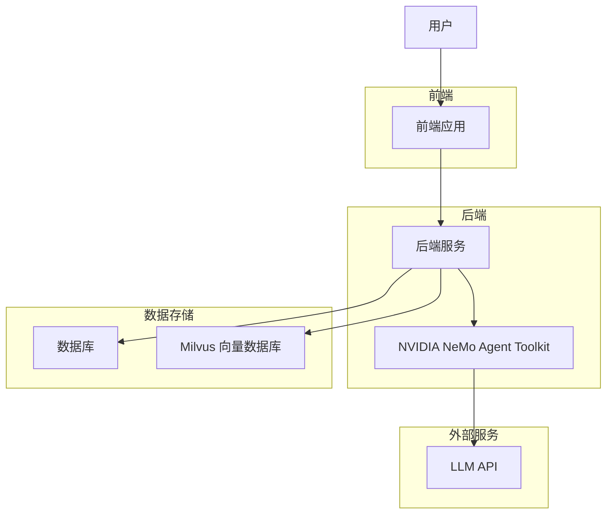
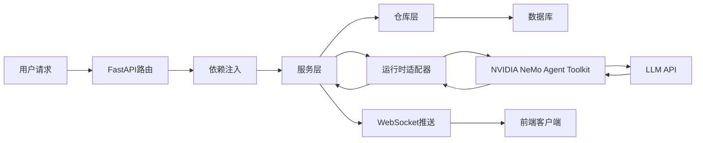
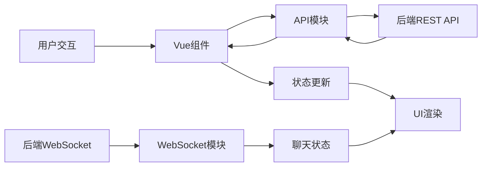
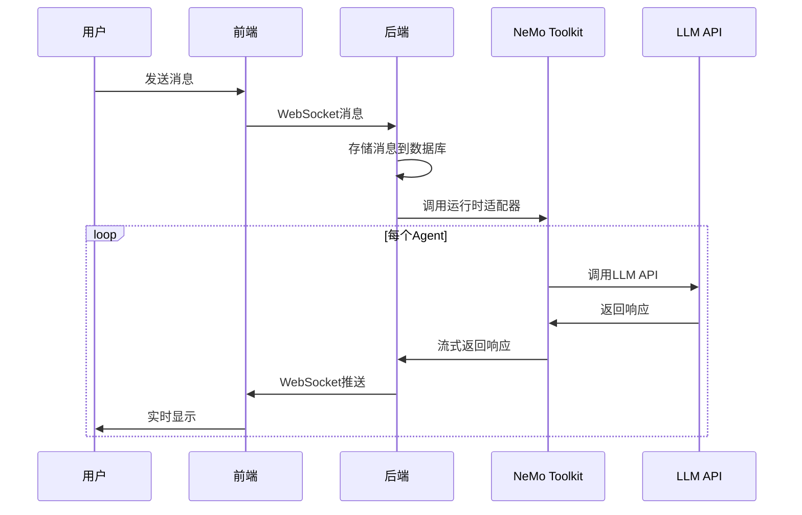
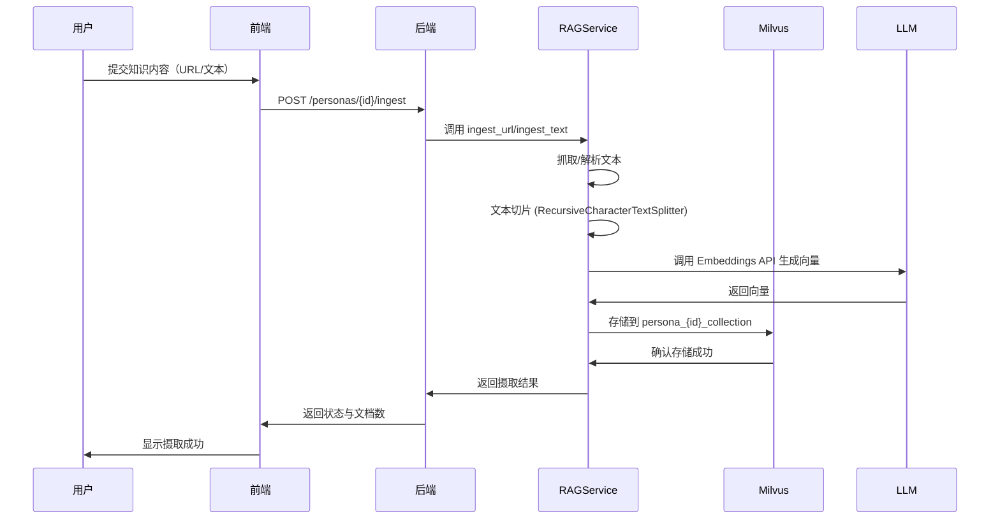
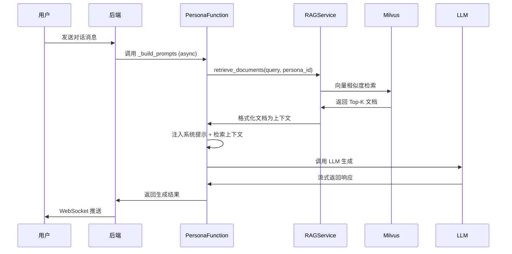

# Mul-in-One 项目架构与组件分析

## 项目概述

Mul-in-One 是一个基于 NVIDIA NeMo Agent Toolkit 构建的多智能体对话服务系统。该项目实现了多个 AI Agent 之间的自然群聊互动，并提供了一套完整的后端服务，支持数据库持久化和通过 REST/WebSocket 与前端应用集成。

## 技术栈

### 后端技术栈
- **编程语言**: Python 3.11+
- **Web框架**: FastAPI
- **数据库**: PostgreSQL (主要), SQLite (测试)
- **ORM**: SQLAlchemy (异步)
- **数据库迁移**: Alembic
- **对话引擎**: NVIDIA NeMo Agent Toolkit
- **RAG 集成**: LangChain, OpenAIEmbeddings, OpenAI
- **向量数据库**: Milvus
- **包管理**: uv

### 前端技术栈
- **框架**: Vue.js 3
- **构建工具**: Vite
- **UI组件库**: Quasar
- **状态管理**: Vue Composition API
- **包管理**: npm

### 开发环境
- **环境管理**: Nix
- **Python虚拟环境**: uv

## 系统架构

## 后端组件依赖关系

### 核心模块

1. **主应用模块** ([src/mul_in_one_nemo/service/app.py](src/mul_in_one_nemo/service/app.py:10))
   - 创建 FastAPI 应用实例
   - 注册路由模块

2. **配置模块** ([src/mul_in_one_nemo/config.py](src/mul_in_one_nemo/config.py:26))
   - 管理应用配置
   - 从环境变量加载配置
   - 支持数据库URL、API密钥等配置项

3. **数据库模块** ([src/mul_in_one_nemo/db/](src/mul_in_one_nemo/db/__init__.py:15))
   - 数据库连接管理
   - 异步会话工厂
   - 会话上下文管理器

4. **模型模块** ([src/mul_in_one_nemo/db/models.py](src/mul_in_one_nemo/db/models.py:22))
   - 数据库表结构定义
   - SQLAlchemy 模型类
   - 包含 Tenant、User、APIProfile、Persona、Session、SessionMessage 等模型

5. **服务模块** ([src/mul_in_one_nemo/service/](src/mul_in_one_nemo/service/__init__.py:1))
   - 业务逻辑实现
   - API 路由处理
   - 会话管理服务

6. **路由模块** ([src/mul_in_one_nemo/service/routers/](src/mul_in_one_nemo/service/routers/__init__.py:1))
   - 会话相关路由 ([sessions.py](src/mul_in_one_nemo/service/routers/sessions.py:13))
   - Persona 和 API Profile 路由 ([personas.py](src/mul_in_one_nemo/service/routers/personas.py:14))

7. **仓库模块** ([src/mul_in_one_nemo/service/repositories.py](src/mul_in_one_nemo/service/repositories.py:22))
   - 数据访问层实现
   - SQLAlchemy 查询封装
   - 包含 SessionRepository、PersonaDataRepository 等

8. **依赖注入模块** ([src/mul_in_one_nemo/service/dependencies.py](src/mul_in_one_nemo/service/dependencies.py:24))
   - FastAPI 依赖注入配置
   - 单例模式实现
   - 服务实例管理

9. **运行时模块** ([src/mul_in_one_nemo/runtime.py](src/mul_in_one_nemo/runtime.py:19))
   - 与 NVIDIA NeMo Agent Toolkit 集成
   - 多智能体运行时环境
   - Persona 函数注册

10. **调度器模块** ([src/mul_in_one_nemo/scheduler.py](src/mul_in_one_nemo/scheduler.py:19))
    - 多智能体对话调度
    - 主动性计算
    - 冷却机制管理

11. **内存管理模块** ([src/mul_in_one_nemo/memory.py](src/mul_in_one_nemo/memory.py:20))
    - 对话历史管理
    - 消息存储和检索

12. **Persona模块** ([src/mul_in_one_nemo/persona.py](src/mul_in_one_nemo/persona.py:10))
    - Persona 模型定义
    - YAML 配置文件加载
    - Persona 设置管理

13. **CLI模块** ([src/mul_in_one_nemo/cli.py](src/mul_in_one_nemo/cli.py:36))
    - 命令行接口实现
    - 交互式对话驱动

14. **RAG服务模块** ([src/mul_in_one_nemo/service/rag_service.py](src/mul_in_one_nemo/service/rag_service.py:1))
    - 知识库摄取（URL/文本）
    - Milvus 向量存储集成
    - 文档检索与上下文注入
    - LangChain 集成（Embeddings, LLM）
    - 数据库配置动态解析

15. **RAG依赖模块** ([src/mul_in_one_nemo/service/rag_dependencies.py](src/mul_in_one_nemo/service/rag_dependencies.py:1))
    - 轻量级单例访问器
    - 避免循环依赖

### 后端数据流动逻辑

1. **API请求处理流程**:
   - 用户发起 HTTP 请求到 FastAPI 路由
   - 通过依赖注入获取服务实例
   - 服务层调用仓库层进行数据操作
   - 数据库持久化存储
   - 返回响应给前端

2. **对话处理流程**:
   - 用户通过 WebSocket 发送消息
   - 后端接收消息并存储到数据库
   - SessionService 处理消息并调用 RuntimeAdapter
   - RuntimeAdapter 调用 NVIDIA NeMo Agent Toolkit
   - 多个 Agent 依次生成响应
   - 响应通过 WebSocket 实时推送给前端

3. **Persona管理流程**:
   - 通过 REST API 管理 Persona 配置
   - Persona 数据存储在数据库中
   - 运行时从数据库加载 Persona 配置
   - 与 NVIDIA NeMo Agent Toolkit 集成

## 前端组件依赖关系

### 核心模块

1. **主应用** ([src/mio_frontend/mio-frontend/src/App.vue](src/mio_frontend/mio-frontend/src/App.vue:1))
   - 应用根组件
   - 路由视图容器

2. **路由配置** ([src/mio_frontend/mio-frontend/src/router/index.ts](src/mio_frontend/mio-frontend/src/router/index.ts:10))
   - 页面路由定义
   - 路由守卫实现
   - 页面组件映射

3. **API通信模块** ([src/mio_frontend/mio-frontend/src/api.ts](src/mio_frontend/mio-frontend/src/api.ts:26))
   - REST API 调用封装
   - 请求拦截器配置
   - 认证状态管理

4. **WebSocket模块** ([src/mio_frontend/mio-frontend/src/websocket.ts](src/mio_frontend/mio-frontend/src/websocket.ts:23))
   - WebSocket 客户端实现
   - 自动重连机制
   - 消息处理封装

5. **聊天状态管理** ([src/mio_frontend/mio-frontend/src/composables/useChat.ts](src/mio_frontend/mio-frontend/src/composables/useChat.ts:4))
   - 聊天状态组合式函数
   - 消息流管理
   - WebSocket 连接管理

6. **UI组件**:
   - 登录页面 ([LoginPage.vue](src/mio_frontend/mio-frontend/src/pages/LoginPage.vue:1))
   - 会话列表页面 ([SessionsPage.vue](src/mio_frontend/mio-frontend/src/pages/SessionsPage.vue:1))
   - Persona管理页面 ([PersonasPage.vue](src/mio_frontend/mio-frontend/src/pages/PersonasPage.vue:1))
   - API Profile管理页面 ([ApiProfilesPage.vue](src/mio_frontend/mio-frontend/src/pages/ApiProfilesPage.vue:1))
   - 聊天对话页面 ([ChatConversationPage.vue](src/mio_frontend/mio-frontend/src/pages/ChatConversationPage.vue:1))

### 前端数据流动逻辑

1. **页面加载流程**:
   - 路由匹配加载对应页面组件
   - 组件挂载时调用 API 获取数据
   - 数据存储在组件状态中
   - 通过 Vue 响应式系统更新 UI

2. **聊天消息流程**:
   - 用户输入消息通过 WebSocket 发送到后端
   - 后端处理消息并生成 Agent 响应
   - Agent 响应通过 WebSocket 实时推送
   - 前端接收消息并更新聊天状态
   - Vue 响应式系统自动更新 UI

3. **数据管理流程**:
   - 通过 API 模块与后端 REST API 交互
   - 使用 Axios 进行 HTTP 请求
   - 请求拦截器自动添加认证信息
   - 响应数据存储在组件状态中

## 业务逻辑

### 核心业务实体

1. **Tenant (租户)**:
   - 多租户架构支持
   - 用户和资源隔离

2. **User (用户)**:
   - 用户身份管理
   - 与租户关联

3. **Persona (角色)**:
   - AI Agent 的人格定义
   - 包含名称、提示词、语调等属性
   - 可绑定不同的 LLM API 配置
   - 支持背景经历字段（自动摄取到 RAG 知识库，通过向量检索增强对话）

4. **API Profile (API配置)**:
   - LLM API 连接配置
   - 包含基础URL、模型名称、API密钥等
   - 运行时动态解析为 Persona 提供配置

5. **Session (会话)**:
   - 用户与 Agent 的对话会话
   - 包含会话历史和参与者信息
   - 支持无限历史窗口（memory_window = -1）

6. **SessionMessage (会话消息)**:
   - 会话中的具体消息
   - 包含发送者、内容等信息

7. **RAG 知识库**:
   - 按 Persona 分集存储在 Milvus 中
   - 支持 URL 抓取和直接文本摄取
   - 向量检索增强对话上下文

### 核心工作流程

#### 1. 多智能体对话流程

1. 用户在前端界面输入消息
2. 前端通过 WebSocket 将消息发送到后端
3. 后端接收消息并存储到数据库
4. SessionService 调用 RuntimeAdapter 处理消息
5. RuntimeAdapter 调用 NVIDIA NeMo Agent Toolkit
6. 多个 Agent 依次调用 LLM API 生成响应
7. Agent 响应通过 WebSocket 实时推送给前端
8. 前端实时显示 Agent 响应

#### 2. Persona管理流程

1. 用户通过前端界面创建/编辑 Persona
2. 前端调用 REST API 将 Persona 数据发送到后端
3. 后端验证数据并存储到数据库
4. 运行时从数据库加载最新的 Persona 配置
5. 新的对话会话使用更新后的 Persona 配置

#### 3. API Profile管理流程

1. 用户通过前端界面创建/编辑 API Profile
2. 前端调用 REST API 将 API Profile 数据发送到后端
3. 后端验证数据并加密存储 API 密钥到数据库
4. Persona 可以绑定到特定的 API Profile
5. 运行时根据绑定关系使用相应的 API 配置

#### 4. RAG 知识库管理流程

**知识检索与注入流程**:

### 调度机制

1. **主动性计算**:
   - 每个 Persona 有主动性属性 (0.0-1.0)
   - 根据上下文和历史对话计算发言概率

2. **冷却机制**:
   - 刚发过言的 Agent 进入冷却期
   - 避免单个 Agent 连续发言

3. **@提及机制**:
   - 用户可以 @ 特定的 Agent
   - 被提及的 Agent 必须回复

4. **冷场检测**:
   - 检测对话是否冷场
   - 降低发言阈值以激活更多 Agent

## 部署架构

### 开发环境

1. **Nix环境管理** ([flake.nix](flake.nix:1))
   - 统一开发环境配置
   - 自动安装依赖项

2. **数据库管理**:
   - 本地 PostgreSQL 实例
   - 数据库迁移脚本 ([alembic/](alembic/env.py:1))

### 生产环境

1. **后端服务**:
   - FastAPI 应用
   - ASGI 服务器 (如 uvicorn)
   - 数据库连接池

2. **前端应用**:
   - 构建后的静态文件
   - Web 服务器 (如 nginx)

3. **数据库**:
   - PostgreSQL 数据库
   - 定期备份策略

4. **向量数据库**:
   - Milvus 实例（推荐 Docker 部署）
   - 持久化存储配置
   - 集合备份与恢复策略

## 安全考虑

1. **API密钥加密**:
   - API 密钥在数据库中加密存储
   - 使用加密密钥进行加解密

2. **认证授权**:
   - 基于租户的资源隔离
   - 用户角色权限控制

3. **数据传输安全**:
   - HTTPS 加密传输
   - WebSocket 安全连接 (wss)

## 扩展性设计

1. **插件化架构**:
   - 支持不同的 LLM 提供商
   - 可扩展的 Persona 功能

2. **多租户支持**:
   - 数据库层面的租户隔离
   - 可配置的资源限制

3. **微服务潜力**:
   - 模块化设计便于拆分
   - API 优先的设计理念

## 总结

Mul-in-One 项目通过结合 FastAPI 的高性能后端和 Vue.js 的现代化前端，构建了一个功能完整的多智能体对话系统。系统充分利用了 NVIDIA NeMo Agent Toolkit 的强大能力，实现了自然流畅的多 Agent 对话体验。

**核心成就**:
- ✅ **完整的 RAG 集成**: 通过 Milvus 向量数据库和 LangChain，实现了知识库摄取、检索和生成全链路
- ✅ **数据库驱动配置**: 运行时动态解析 Persona 的 API 配置，支持多租户 SaaS 架构
- ✅ **灵活的会话语义**: 支持无限历史窗口和回合限制，适应不同对话场景
- ✅ **模块化架构**: 清晰的分层设计便于维护和扩展

通过清晰的架构设计和模块化实现，系统具有良好的可维护性和扩展性，为后续的检索质量优化、多模态支持和企业级功能提供了坚实基础。