# Mio 平台架构设计文档

## 1. 项目概述

Mio（Mul-in-One）是一个 Persona 驱动、RAG 增强、可观测编排的多智能体协作系统。基于 NVIDIA NeMo Agent Toolkit 构建,面向企业知识问答与复杂任务执行场景,实现从意图解析到跨智能体闭环协作的工程化落地。系统支持多租户 SaaS 架构,提供完整的数据库持久化、REST/WebSocket 实时通信及前端可视化交互能力。

## 2. 架构设计原则

### 2.1 核心设计理念

1. **模块化与可扩展性**

   - 清晰的分层架构,服务间低耦合高内聚
   - 插件化 Persona 与工具函数注册机制
   - 支持多 LLM 提供商动态切换
2. **多租户隔离与安全**

   - 数据库层面的租户分区(Tenant Isolation)
   - Milvus Collection 按 Persona 隔离存储
   - API 密钥加密存储,HTTPS/WSS 加密传输
3. **可观测性与可解释性**

   - 完整的链路追踪(请求→检索→生成→输出)
   - 指标驱动的策略优化(Recall@K, MRR, 时延)
   - 生成结果附带知识来源标注
4. **高性能与低时延**

   - 异步 I/O(FastAPI + SQLAlchemy Async)
   - Milvus HNSW 索引实现毫秒级检索
   - WebSocket 流式输出,降低首字时延

### 2.2 技术选型理由

| 技术栈               | 选型                      | 理由                                               |
| -------------------- | ------------------------- | -------------------------------------------------- |
| **后端框架**   | FastAPI                   | 原生异步支持,高性能,自动生成 OpenAPI 文档          |
| **数据库**     | PostgreSQL                | 成熟的关系型数据库,支持 JSONB 与复杂查询           |
| **ORM**        | SQLAlchemy 2.0            | 异步支持,类型安全,灵活的查询 DSL                   |
| **向量数据库** | Milvus                    | 开源高性能,支持 HNSW/IVF 多种索引,易于扩展         |
| **对话引擎**   | NVIDIA NeMo Agent Toolkit | 企业级多智能体框架,工具链成熟,社区活跃             |
| **RAG 集成**   | LangChain                 | 丰富的 Loader/Splitter 组件,Embedding 模型集成完善 |
| **前端框架**   | Vue 3 + Vite              | 组合式 API,响应式系统,开发体验优秀                 |
| **UI 组件库**  | Quasar                    | Material Design,跨平台,组件丰富                    |

## 3. 技术栈概览

### 3.1 后端技术栈

- **编程语言**: Python 3.11+
- **Web框架**: FastAPI
- **数据库**: PostgreSQL (主要), SQLite (测试)
- **ORM**: SQLAlchemy (异步)
- **数据库迁移**: Alembic
- **对话引擎**: NVIDIA NeMo Agent Toolkit（工具优先、函数调用）
- **RAG 集成**: LangChain, OpenAIEmbeddings, OpenAI
- **向量数据库**: Milvus
- **包管理**: uv

### 3.2 前端技术栈

- **框架**: Vue.js 3
- **构建工具**: Vite
- **UI组件库**: Quasar
- **状态管理**: Vue Composition API
- **包管理**: npm

### 3.3 开发环境

- **环境管理**: Nix
- **Python虚拟环境**: uv

## 4. 系统总体架构

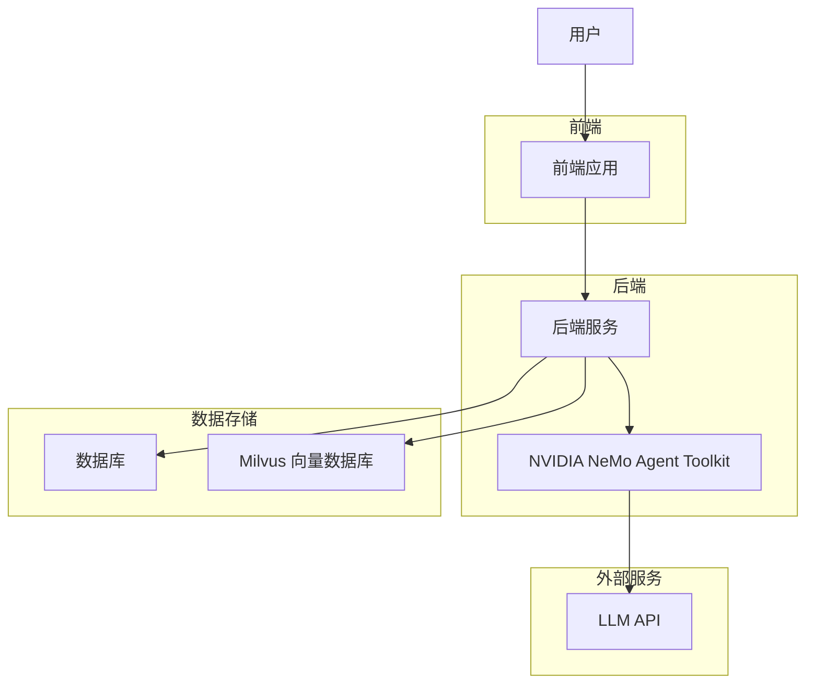

## 后端组件依赖关系

### 核心模块

1. **主应用模块** ([src/mul_in_one_nemo/service/app.py](src/mul_in_one_nemo/service/app.py:10))

   - 创建 FastAPI 应用实例
   - 注册路由模块
2. **配置模块** ([src/mul_in_one_nemo/config.py](src/mul_in_one_nemo/config.py:26))

   - 管理应用配置
   - 从环境变量加载配置
   - 支持数据库URL、API密钥等配置项
3. **数据库模块** ([src/mul_in_one_nemo/db/](src/mul_in_one_nemo/db/__init__.py:15))

   - 数据库连接管理
   - 异步会话工厂
   - 会话上下文管理器
4. **模型模块** ([src/mul_in_one_nemo/db/models.py](src/mul_in_one_nemo/db/models.py:22))

   - 数据库表结构定义
   - SQLAlchemy 模型类
   - 包含 Tenant、User、APIProfile、Persona、Session、SessionMessage 等模型
5. **服务模块** ([src/mul_in_one_nemo/service/](src/mul_in_one_nemo/service/__init__.py:1))

   - 业务逻辑实现
   - API 路由处理
   - 会话管理服务
6. **路由模块** ([src/mul_in_one_nemo/service/routers/](src/mul_in_one_nemo/service/routers/__init__.py:1))

   - 会话相关路由 ([sessions.py](src/mul_in_one_nemo/service/routers/sessions.py:13))
   - Persona 和 API Profile 路由 ([personas.py](src/mul_in_one_nemo/service/routers/personas.py:14))
7. **仓库模块** ([src/mul_in_one_nemo/service/repositories.py](src/mul_in_one_nemo/service/repositories.py:22))

   - 数据访问层实现
   - SQLAlchemy 查询封装
   - 包含 SessionRepository、PersonaDataRepository 等
8. **依赖注入模块** ([src/mul_in_one_nemo/service/dependencies.py](src/mul_in_one_nemo/service/dependencies.py:24))

   - FastAPI 依赖注入配置
   - 单例模式实现
   - 服务实例管理

   9. **运行时模块** ([src/mul_in_one_nemo/runtime.py](src/mul_in_one_nemo/runtime.py:19))

   - 与 NVIDIA NeMo Agent Toolkit 集成
   - 多智能体运行时环境
   - 注册 Persona 函数与通用工具（WebSearch、RagQuery）
9. **调度器模块** ([src/mul_in_one_nemo/scheduler.py](src/mul_in_one_nemo/scheduler.py:19))

   - 多智能体对话调度
   - 主动性计算
   - 冷却机制管理
10. **内存管理模块** ([src/mul_in_one_nemo/memory.py](src/mul_in_one_nemo/memory.py:20))

    - 对话历史管理
    - 消息存储和检索
11. **Persona模块** ([src/mul_in_one_nemo/persona.py](src/mul_in_one_nemo/persona.py:10))

    - Persona 模型定义
    - YAML 配置文件加载
    - Persona 设置管理
12. **CLI模块** ([src/mul_in_one_nemo/cli.py](src/mul_in_one_nemo/cli.py:36))

    - 命令行接口实现
    - 交互式对话驱动
13. **RAG服务模块** ([src/mul_in_one_nemo/service/rag_service.py](src/mul_in_one_nemo/service/rag_service.py:1))

    - 知识库摄取（URL/文本）
    - Milvus 向量存储集成
    - 文档检索（供 RagQuery 工具调用）
    - 支持动态租户配置（tenant_id 关联）
    - LangChain 集成（Embeddings, LLM）
14. **工具模块**（NAT 标准化实现 - Tool-First 设计）

    Mio 采用**工具优先(Tool-First)**设计理念,将知识检索和外部能力封装为标准化的NAT工具,由LLM根据对话上下文**按需调用**,而非预先注入上下文。这种设计显著提升了系统灵活性和token效率。

    - **WebSearch 工具** ([src/mul_in_one_nemo/tools/web_search_tool.py](src/mul_in_one_nemo/tools/web_search_tool.py))

      - **功能**: 自包含的Web搜索实现,内置 DuckDuckGo HTML 搜索引擎和页面内容抓取
      - **输入参数**: query(搜索词), top_k(结果数,默认3), fetch_snippets(是否抓取页面,默认True)
      - **输出格式**: `[{"title": "...", "url": "...", "snippet": "..."}]`
      - **技术特点**: 无外部依赖服务,直接使用 httpx 和正则解析,支持失败重试和内容清洗
      - **调用时机**: LLM判断需要外部实时信息时主动调用
    - **RagQuery 工具** ([src/mul_in_one_nemo/tools/rag_query_tool.py](src/mul_in_one_nemo/tools/rag_query_tool.py))

      - **功能**: 封装 RAGService.retrieve_documents,按需检索Persona专属知识库
      - **输入参数**: query(查询词), persona_id(目标Persona ID), top_k(文档数,默认5)
      - **输出格式**: `[{"text": "文档内容", "source": "来源URL/标识"}]`
      - **技术特点**: 动态路由到对应Persona的Milvus Collection,语义相似度排序
      - **调用时机**: LLM判断需要专业知识或背景信息时主动调用
      - **优势**: 避免预注入大量无关知识占用token,LLM按需精准检索,支持多轮精炼
    - **设计理念对比**:

      ```
      传统RAG(预注入):  [System Prompt + 全部知识库Top-K + 历史] → LLM
                      ↓ 问题: Token浪费,上下文污染

      Tool-First:     [System Prompt + 工具定义 + 历史] → LLM
                      ↓ LLM决策
                      → RagQuery("产品A特性") → 检索 → LLM融合生成
                      ↓ 优势: 按需检索,Token高效,支持多轮对话
      ```
15. **调试与监控模块**

    - **调试路由** ([src/mul_in_one_nemo/service/routers/debug.py](src/mul_in_one_nemo/service/routers/debug.py))
      - 提供系统运行时状态查询接口
      - 支持查看当前加载的Persona和会话状态
      - 便于开发调试和问题排查
    - **健康检查功能**:
      - API Profile健康检查 (测试LLM连接和Embedding API)
      - RAG服务状态监控
      - Milvus连接状态检测
      - 数据库连接池状态
    - **日志增强**:
      - 详细的操作日志记录(Persona创建/更新/删除)
      - API调用链路追踪
      - 错误堆栈和异常捕获
      - 调试模式开关
16. **RAG依赖模块** ([src/mul_in_one_nemo/service/rag_dependencies.py](src/mul_in_one_nemo/service/rag_dependencies.py:1))

    - 轻量级单例访问器
    - 避免循环依赖

### 后端数据流动逻辑

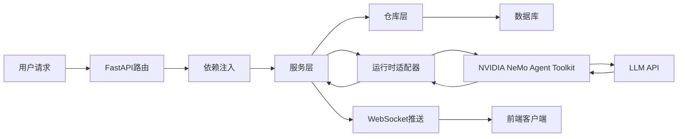

1. **API请求处理流程**:

   - 用户发起 HTTP 请求到 FastAPI 路由
   - 通过依赖注入获取服务实例
   - 服务层调用仓库层进行数据操作
   - 数据库持久化存储
   - 返回响应给前端
2. **对话处理流程**:

   - 用户通过 WebSocket 发送消息
   - 后端接收消息并存储到数据库
   - SessionService 处理消息并调用 RuntimeAdapter
   - RuntimeAdapter 调用 NVIDIA NeMo Agent Toolkit
   - 多个 Agent 依次生成响应
   - 响应通过 WebSocket 实时推送给前端
3. **Persona管理流程**:

   - 通过 REST API 管理 Persona 配置
   - Persona 数据存储在数据库中
   - 运行时从数据库加载 Persona 配置
   - 与 NVIDIA NeMo Agent Toolkit 集成

## 前端组件依赖关系

### 核心模块

1. **主应用** ([src/mio_frontend/mio-frontend/src/App.vue](src/mio_frontend/mio-frontend/src/App.vue:1))

   - 应用根组件
   - 路由视图容器
2. **路由配置** ([src/mio_frontend/mio-frontend/src/router/index.ts](src/mio_frontend/mio-frontend/src/router/index.ts:10))

   - 页面路由定义
   - 路由守卫实现
   - 页面组件映射
3. **API通信模块** ([src/mio_frontend/mio-frontend/src/api.ts](src/mio_frontend/mio-frontend/src/api.ts:26))

   - REST API 调用封装
   - 请求拦截器配置
   - 认证状态管理
4. **WebSocket模块** ([src/mio_frontend/mio-frontend/src/websocket.ts](src/mio_frontend/mio-frontend/src/websocket.ts:23))

   - WebSocket 客户端实现
   - 自动重连机制
   - 消息处理封装
5. **聊天状态管理** ([src/mio_frontend/mio-frontend/src/composables/useChat.ts](src/mio_frontend/mio-frontend/src/composables/useChat.ts:4))

   - 聊天状态组合式函数
   - 消息流管理
   - WebSocket 连接管理
6. **UI组件**:

   - 登录页面 ([LoginPage.vue](src/mio_frontend/mio-frontend/src/pages/LoginPage.vue:1))
     - 用户认证和登录
     - 租户选择
   - 会话列表页面 ([SessionsPage.vue](src/mio_frontend/mio-frontend/src/pages/SessionsPage.vue:1))
     - 显示所有会话列表
     - 创建新会话
     - 会话搜索和过滤
   - Persona管理页面 ([PersonasPage.vue](src/mio_frontend/mio-frontend/src/pages/PersonasPage.vue:1))
     - **增强输入验证**名称、系统提示词必填
     - **知识库管理**: 支持URL/文本摄取、刷新RAG
     - **实时健康检查**: 显示API Profile连接状态
     - **背景信息管理**: 直接编辑Persona背景并自动同步到RAG
   - API Profile管理页面 ([ApiProfilesPage.vue](src/mio_frontend/mio-frontend/src/pages/ApiProfilesPage.vue:1))
     - **一键健康检查**: 测试API连接状态
     - **配置类型区分**: LLM vs Embedding配置
     - **状态指示器**: 连接正常/异常实时显示
     - 支持创建、编辑、测试和删除API Profile
   - 聊天对话页面 ([ChatConversationPage.vue](src/mio_frontend/mio-frontend/src/pages/ChatConversationPage.vue:1))
     - **用户可选择激活的Persona参与对话**
     - **实时显示Agent发言状态** (Thinking/Speaking/Cooldown)
     - 流式消息显示
     - 支持@提及特定Agent
   - **调试页面** ([DebugPage.vue](src/mio_frontend/mio-frontend/src/pages/DebugPage.vue:1))
     - 查看系统运行时状态
     - 监控活跃会话和Persona加载情况
     - 开发者工具和日志查看
     - 性能指标监控

### 前端数据流动逻辑

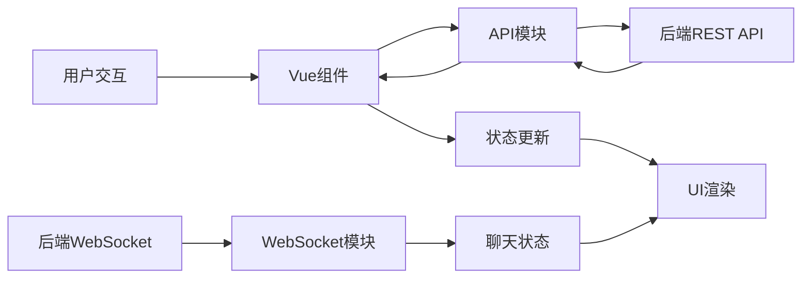

1. **页面加载流程**:

   - 路由匹配加载对应页面组件
   - 组件挂载时调用 API 获取数据
   - 数据存储在组件状态中
   - 通过 Vue 响应式系统更新 UI
2. **聊天消息流程**:

   - 用户输入消息通过 WebSocket 发送到后端
   - 后端处理消息并生成 Agent 响应
   - Agent 响应通过 WebSocket 实时推送
   - 前端接收消息并更新聊天状态
   - Vue 响应式系统自动更新 UI
3. **数据管理流程**:

   - 通过 API 模块与后端 REST API 交互
   - 使用 Axios 进行 HTTP 请求
   - 请求拦截器自动添加认证信息
   - 响应数据存储在组件状态中

## 业务逻辑

### 核心业务实体

1. **Tenant (租户)**:

   - 多租户架构支持
   - 用户和资源隔离
   - **全局配置管理**:
     - 租户级Embedding API配置(tenant_embedding_api_profile)
     - 统一的向量化策略管理
     - 配额和资源限制
   - **数据隔离**:
     - PostgreSQL数据库按tenant_id分区
     - Milvus Collection按Persona隔离(间接实现租户隔离)
     - API密钥加密存储
2. **User (用户)**:

   - 用户身份管理
   - 与租户关联
3. **Persona (角色)**:

   - AI Agent 的人格定义
   - 包含名称、提示词、语调等属性
   - 可绑定不同的 LLM API 配置
   - 支持背景经历字段（自动摄取到 RAG 知识库，通过RagQuery工具按需检索）
   - **创建时自动化流程**:
     - 解析并验证Persona配置
     - 自动创建Milvus Collection (persona_{id}_collection)
     - 将background字段自动切片、向量化并摄取到知识库
     - 支持URL和文本两种知识源
     - 支持后续追加知识摄取和RAG刷新
   - **健康检查**: 验证绑定的API Profile连接状态和可用性
4. **API Profile (API配置)**:

   - LLM API 连接配置
   - 包含基础URL、模型名称、API密钥等
   - 运行时动态解析为 Persona 提供配置
   - **支持多种配置类型**:
     - LLM API 配置(用于对话生成)
     - Embedding API 配置(用于RAG向量化)
     - 租户级全局配置(Tenant Embedding Profile)
   - **健康检查功能**:
     - 实时测试API连接状态
     - 验证API密钥有效性
     - 检查模型可用性
   - **前端管理界面**: 支持创建、编辑、测试和删除API Profile
5. **Session (会话)**:

   - 用户与 Agent 的对话会话
   - 包含会话历史和参与者信息
   - 支持无限历史窗口（memory_window = -1）
6. **SessionMessage (会话消息)**:

   - 会话中的具体消息
   - 包含发送者、内容等信息
7. **RAG 知识库**:

   - 按 Persona 分集存储在 Milvus 中
   - 支持 URL 抓取和直接文本摄取
   - 向量检索增强对话上下文

### 5.2 RAG 检索增强模块

#### 5.2.1 RAG 系统设计概述

Mio 的 RAG 系统是多智能体对话的核心支撑模块，通过向量化检索为每个 Persona 提供专属的知识库支持，显著提升生成内容的准确性与领域相关性。

#### 5.2.2 RAG 系统架构层次

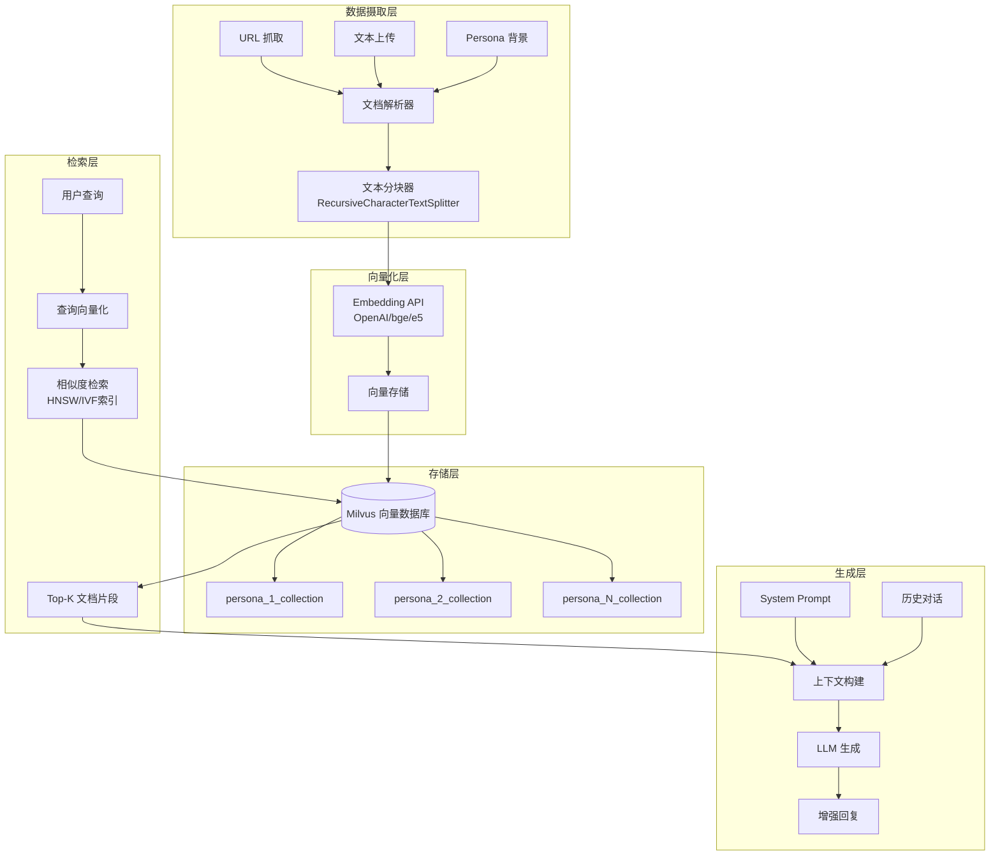

#### 5.2.3 数据摄取与向量化流程

**1. 文档摄取（Ingestion）**

Mio 支持多种数据源的知识库构建：

- **URL 抓取**: 通过 `WebBaseLoader` 自动抓取网页内容，提取正文并清洗格式
- **文本上传**: 直接接收用户提交的文本内容（如产品说明、技术文档、FAQ）
- **Persona 背景**: 自动将 Persona 的 `background` 字段摄取到其专属知识库

**2. 文本分块（Chunking）**

采用 `RecursiveCharacterTextSplitter` 进行智能分块：

- **块大小（chunk_size）**: 默认 1000 字符，保证语义完整性
- **重叠（overlap）**: 200 字符重叠，避免上下文截断
- **分隔符优先级**: 按段落 → 句子 → 单词层级递归切分

**3. 向量化（Embedding）**

- **模型选择**: 支持 OpenAI Embeddings、bge-large-zh、e5-large-v2 等主流嵌入模型
- **维度**: 根据模型选择（如 OpenAI text-embedding-3-small: 1536 维）
- **归一化**: 自动进行 L2 归一化，提升相似度计算精度
- **批量处理**: 批量调用 Embedding API，提升摄取效率

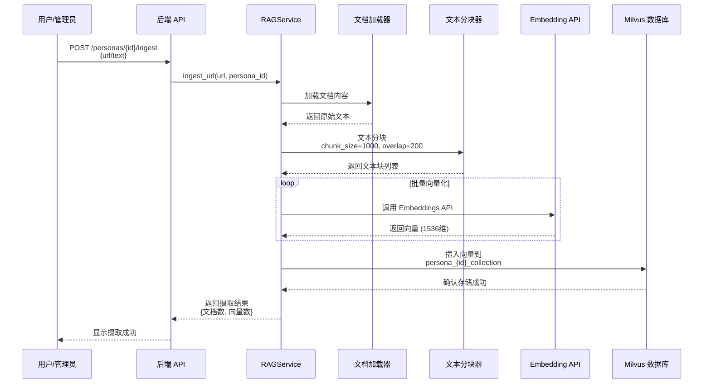

#### 5.2.4 向量检索与相似度计算

**1. 索引结构**

Milvus 采用 **HNSW（Hierarchical Navigable Small World）** 索引：

- **搜索复杂度**: O(log N)，支持百万级向量毫秒级检索
- **参数配置**:
  - `M`: 每层最大连接数（默认 16）
  - `efConstruction`: 构建时搜索深度（默认 200）
  - `ef`: 查询时搜索深度（默认 64）

**2. 相似度度量**

- **度量方式**: 余弦相似度（Cosine Similarity）或内积（Inner Product）
- **归一化**: 向量存储前自动归一化为单位向量
- **Top-K 检索**: 默认返回相似度最高的 3-5 个文档片段

**3. 混合检索（Hybrid Search）**

支持向量检索 + 标量过滤：

- **租户隔离**: 按 `persona_id` 分集存储，保证多租户数据隔离
- **元数据过滤**: 可按 `source`（来源URL）、`timestamp`（摄取时间）等字段过滤
- **重排序**: 检索后可按业务规则（如时效性、权威性）二次排序

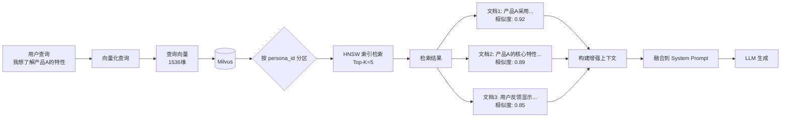

#### 5.2.5 上下文注入与生成增强

**1. 上下文构建策略**

检索到的 Top-K 文档片段按以下结构注入到 Prompt：

```
[System Prompt]
{Persona 设定与能力描述}

[Knowledge Base Context]
根据你的知识库，以下是相关参考信息：
1. [来源: URL/文档A] {文档片段1}
2. [来源: 文档B] {文档片段2}
3. [来源: 文档C] {文档片段3}

[Conversation History]
{最近N轮对话历史}

[Current Query]
用户: {当前问题}
```

**2. 动态上下文窗口管理**

- **Token 预算**: 根据模型上下文限制（如 GPT-4: 8K/32K tokens）动态调整检索数量
- **优先级策略**:
  1. System Prompt（必需）
  2. Top-K 检索结果（核心知识）
  3. 最近 N 轮历史（上下文连贯性）
  4. 早期历史（按需裁剪）

**3. 生成质量保障**

- **来源标注**: 生成回复时自动附带知识来源（如"根据产品文档A..."）
- **置信度评估**: 根据检索相似度判断回复可信度
- **幻觉检测**: 低相似度时触发"我不确定"机制，避免编造事实

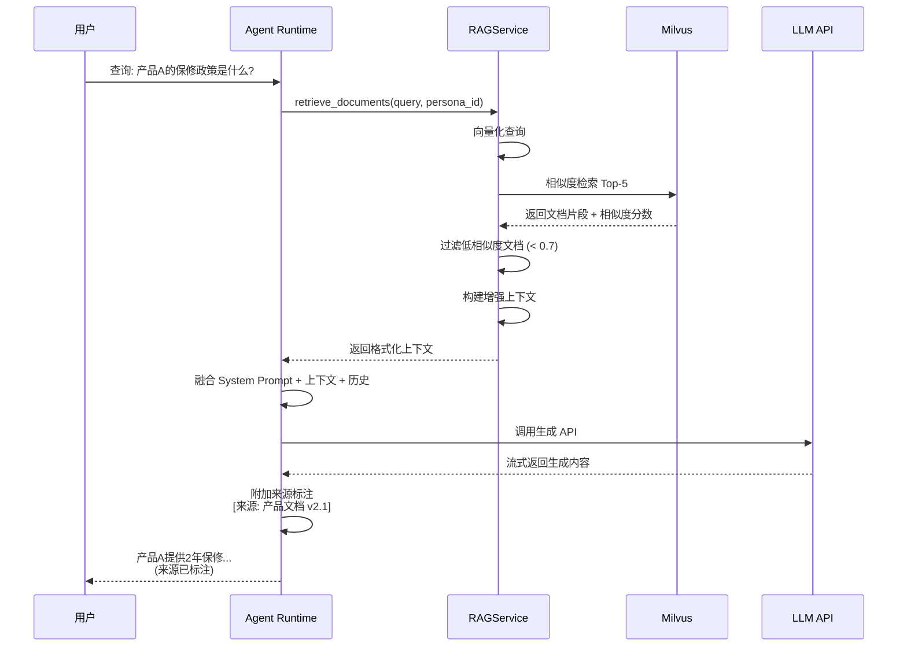

#### 5.2.6 知识库管理与优化

**1. 数据更新与版本控制**

- **增量更新**: 支持追加新文档而不重建整个索引
- **文档去重**: 基于内容哈希避免重复摄取
- **版本标记**: 每个文档片段记录 `ingestion_timestamp` 与 `version`

**2. 索引优化**

- **定期重建**: 在知识库规模变化 >20% 时触发索引重建，优化检索性能
- **分区策略**: 按 Persona 分集，避免跨租户检索干扰
- **TTL 清理**: 可配置文档过期时间，自动清理过时知识

**3. 质量监控**

- **检索质量指标**:
  - Recall@K: 前K个结果的召回率
  - MRR (Mean Reciprocal Rank): 首个相关文档的平均倒数排名
  - nDCG: 归一化折损累计增益
- **A/B 测试**: 支持不同 Embedding 模型、分块策略的效果对比
- **用户反馈**: 收集"答案是否有帮助"反馈，持续优化检索策略

## 6. 业务流程与数据流

### 6.1 核心业务流转机制

本节分三个业务流转核心：最短链路—租户选中一个Persona—生成反馈"你"闭环（打通Persona的闭环流程）

##### 6.1.1 业务流程序列图

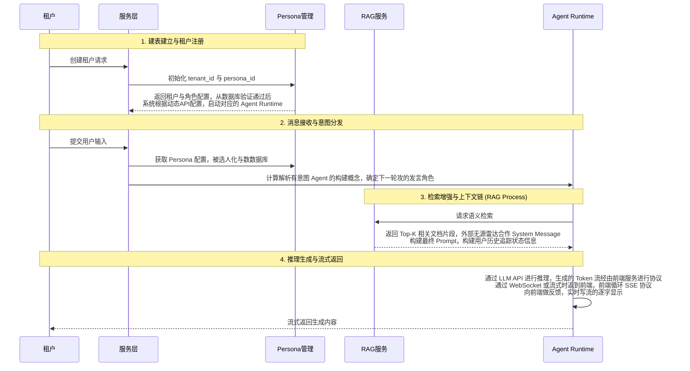

##### 6.1.2 关键步骤说明

**1. 建表建立与租户注册**

- 用户注册并获得 `tenant_id`
- 系统初始化 Persona 配置（从 `persona.yaml` 与 `api_configuration.yaml` 解析）
- 动态绑定 API 配置，准备 Agent Runtime 所需资源
- 在 Milvus 与数据库中建立租户分区

**2. 消息接收与意图分发**

- 前端提交用户输入与选定的 `persona_id`
- 服务层解析意图，判定所需工具与 RAG 策略
- 加载历史会话记忆与 System Message，构建完整上下文
- 启动对应 Persona 的 Agent Runtime

**3. 检索增强与调用外链 (RAG Process)**

- Agent 向 RAG 服务请求，RAG 服务查询 Milvus 获取 Top-K 相似文档片段
- 外部工具（如无源雷达专家系统、企业知识库）并行检索，合并结果
- 对检索结果进行去重、排序与标签过滤（Hybrid Search）
- 将增强上下文融合到 Prompt，形成最终输入

**4. 反馈与记忆更新**

- Agent 生成回复后，将本轮对话、工具调用记录与状态持久化到会话记忆
- 返回生成结果与元数据（如来源文档、置信度、执行链路）
- 前端展示结果并提供可解释性信息（如"答案来源：文档A第3段"）

**5. 可观测与闭环优化**

- 记录关键指标：检索时延、命中率（Recall@K）、工具调用成功率、生成质量评分
- 定期评估策略效果，触发 Persona 配置或 RAG 参数调整
- 形成"计划—执行—评估—优化"的闭环

##### 6.1.3 技术亮点

- **人设持久化**：Persona 配置驱动能力边界与工具权限，保障上下文一致性
- **动态 RAG**：支持在线数据注入与索引重建，混合检索提升召回质量
- **可观测编排**：链路追踪、指标驱动、策略迭代，形成闭环优化
- **多租户隔离**：租户级数据分区与配额管理，保障 SaaS 交付稳定性

### 6.2 多智能体对话流程

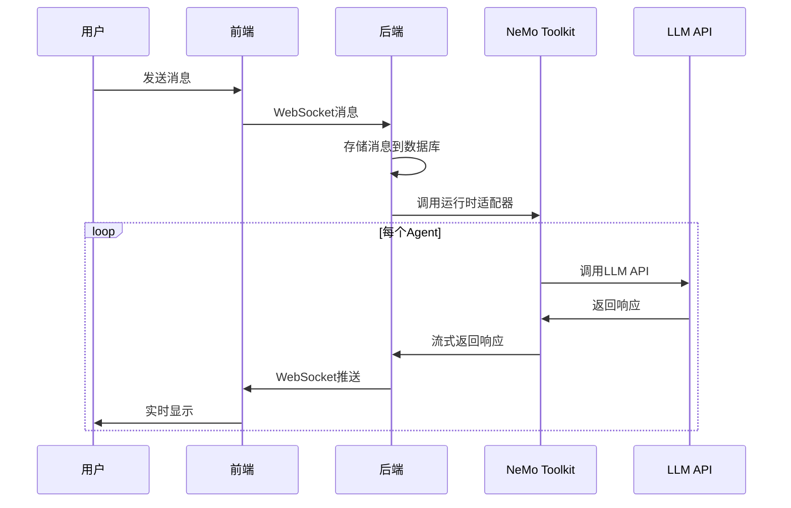

1. 用户在前端界面输入消息
2. 前端通过 WebSocket 将消息发送到后端
3. 后端接收消息并存储到数据库
4. SessionService 调用 RuntimeAdapter 处理消息
5. RuntimeAdapter 调用 NVIDIA NeMo Agent Toolkit
6. 多个 Agent 依次调用 LLM API 生成响应
7. Agent 响应通过 WebSocket 实时推送给前端
8. 前端实时显示 Agent 响应

### 6.3 Persona管理流程

1. 用户通过前端界面创建/编辑 Persona
2. 前端调用 REST API 将 Persona 数据发送到后端
3. 后端验证数据并存储到数据库
4. 运行时从数据库加载最新的 Persona 配置
5. 新的对话会话使用更新后的 Persona 配置

### 6.4 API Profile管理流程

1. 用户通过前端界面创建/编辑 API Profile
2. 前端调用 REST API 将 API Profile 数据发送到后端
3. 后端验证数据并加密存储 API 密钥到数据库
4. Persona 可以绑定到特定的 API Profile
5. 运行时根据绑定关系使用相应的 API 配置

#### 4. RAG 知识库管理流程

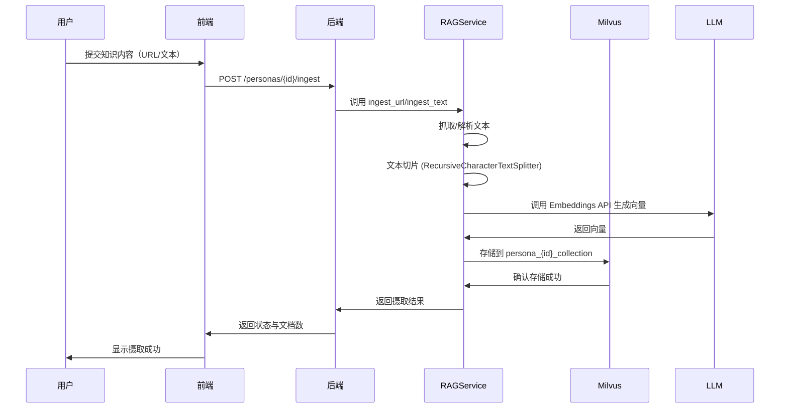

**知识检索与工具化调用流程** (Tool-First 设计):

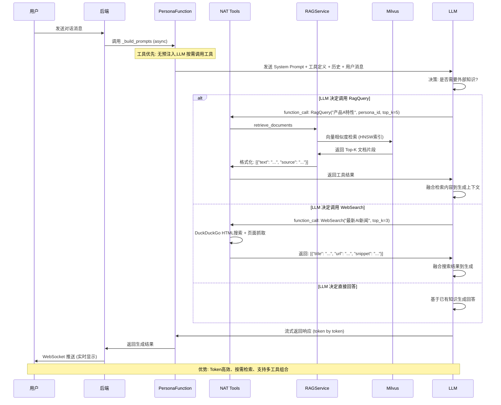

**Tool-First 设计优势**:

1. **Token效率**: 不再预注入大量无关知识,仅在需要时精准检索
2. **灵活性**: LLM可根据问题复杂度决定是否调用工具、调用哪个工具
3. **可扩展性**: 易于添加新工具(如数据库查询、API调用)而不改变核心流程
4. **可解释性**: 工具调用链路清晰,便于追踪知识来源
5. **多轮对话支持**: LLM可在多轮对话中多次调用工具,逐步精炼答案

## 5. 核心模块设计

### 5.1 多智能体协同模块

#### 5.1.1 多智能体协作模型

Mio 采用"异构体协作"系统。用户提问后，系统自动挑选"合适"的多智能体来交互式协作，本节结合 NVIDIA 的 Agent Runtime（"nemo_agentity"套接字/客户端（"Cooldown"机制），概括了基本人类群组交流的语境和生成过程。

##### 5.1.1.1 智能体协作框架（Agent Runtime Model）

Mio 系统在运行时采用 NVIDIA NeMo Agent Runtime 作为多智能体协作的核心框架，每个智能体包含三个核心层面：

- **状态层（State）**: 维护 Agent 自身状态（如冷却计数器、历史发言次数等）
- **策略层（Policy）**: 根据系统提示词（System Prompt）、动态配置及业务需求动态调整发言策略
- **交互层（Interaction）**: 通过工具函数（如 RAG 检索、外部 API 调用）与其他组件或 Agent 协作

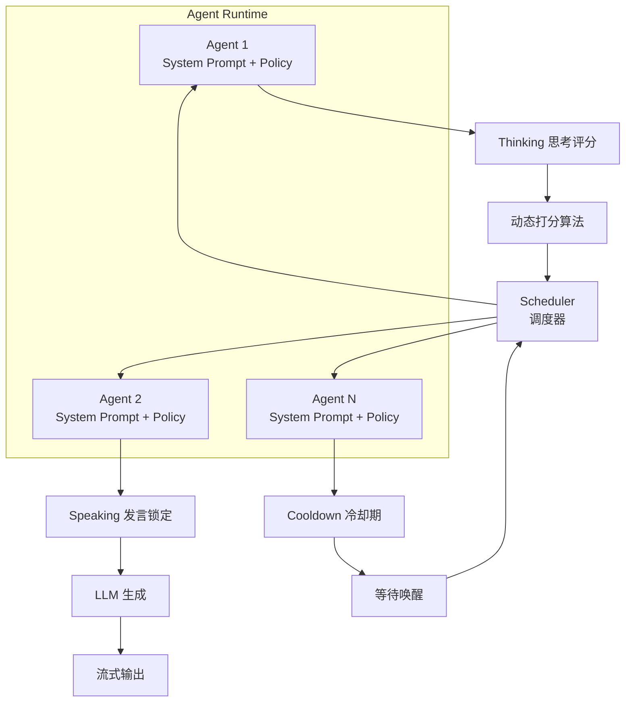

##### 5.1.1.2 基于状态机的动态调度策略

Mio 采用动态调度器（Scheduler）在多个 Agent 之间进行任务分发和协同，系统统一管理多智能体的发言次序和任务编排。调度器采用一个基于动态打分的算法来决定下一轮发言者：

**调度算法核心公式**：

$$
Score(a_i) = \alpha \cdot P_{\text{act}}(a_i) + \beta \cdot Rel(C_{\text{hist}}, a_i) - \gamma \cdot I_{\text{cool}}(a_i) + \delta \cdot M_{\text{mention}}(a_i)
$$

其中：

- $P_{\text{act}}(a_i)$: 智能体的固有主动性概率
- $Rel(C_{\text{hist}}, a_i)$: 历史上下文相关性（通过计算当前对话历史与 Agent System Prompt 的语义相关性）
- $I_{\text{cool}}(a_i)$: 冷却惩罚因子，若处于冷却期则为大于 0，否则为 0
- $M_{\text{mention}}(a_i)$: @提及奖励，若被用户 @ 提及则给高权重加成
- $\alpha, \beta, \gamma, \delta$: 各维度的超参数权重

系统根据 $Score(a_i)$ 降序排列并选出当前得分最高的 Agent 进行下一轮发言。

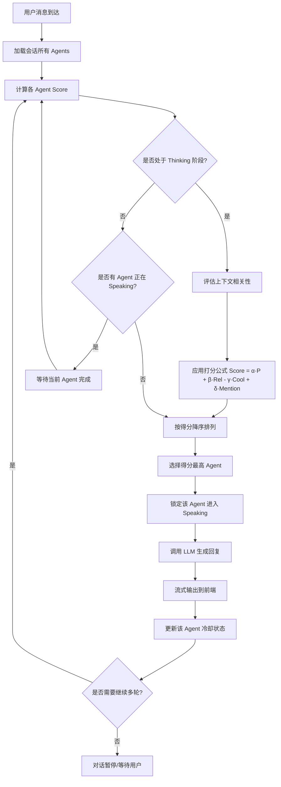

##### 5.1.1.3 Agent 状态转换（Thinking → Speaking → Cooldown）

Mio 中每个 Agent 在一次对话周期内经历三种状态：

1. **Thinking（思考）**: Agent 根据当前上下文计算自身的发言意愿分数，此时尚未锁定 LLM 调用
2. **Speaking（发言）**: 获得锁定（Lock）的 Agent 调用 LLM 生成回复，并进入流式输出阶段
3. **Cooldown（冷却）**: 发言结束后，Agent 强制进入冷却期，避免连续垄断对话

**状态转换图**：

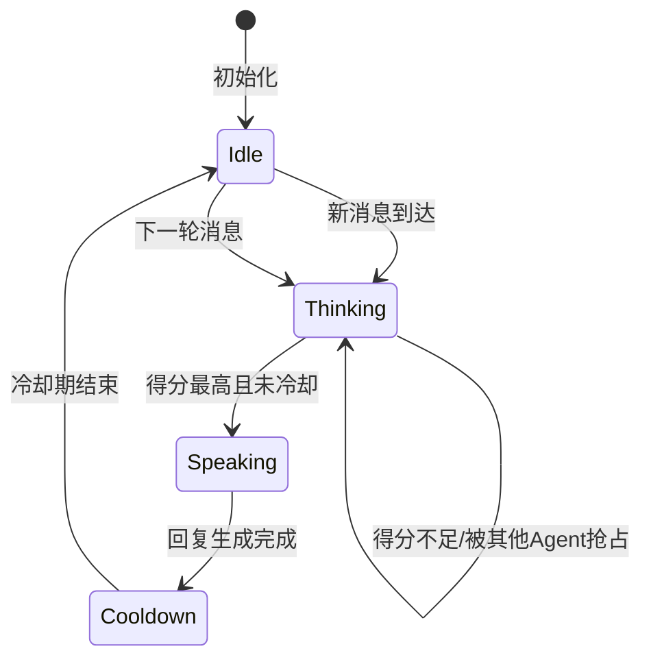

##### 5.1.1.4 冷却机制（Cooldown）详解

为避免单一 Agent 连续发言导致对话单调，Mio 引入**发言后冷却（Post-speaking Cooldown）**机制：

- **冷却计数器**: 每次 Agent 发言后，其冷却计数器设为预设值（如 2-3 轮）
- **惩罚项**: 在冷却期内，该 Agent 的 $I_{\text{cool}}(a_i)$ 项显著增大，导致 Score 降低
- **唤醒条件**:
  - 用户明确 @ 提及该 Agent（$M_{\text{mention}}$ 大幅提升可覆盖冷却惩罚）
  - 冷却计数器递减至 0
  - 系统检测到"冷场"（所有 Agent 得分均低于阈值），此时降低冷却惩罚以激活更多 Agent

**冷却与唤醒流程**：

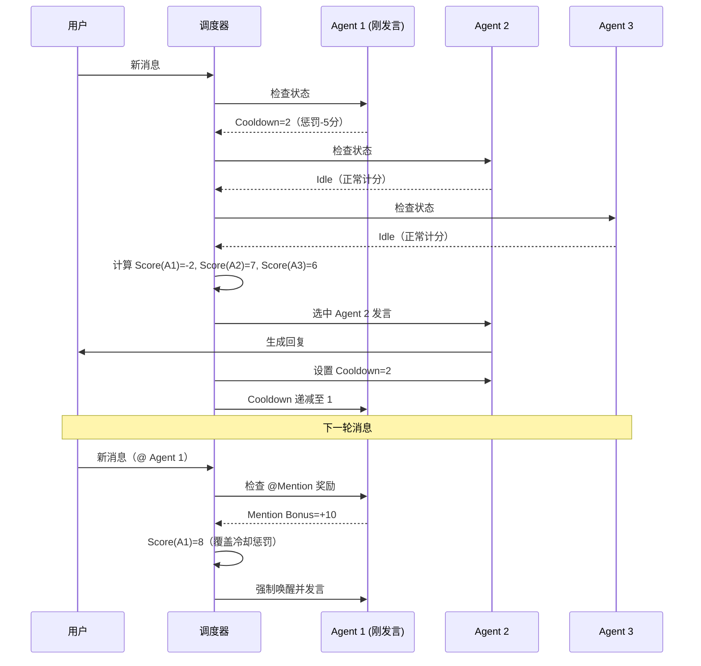

### 6.5 调度机制

1. **主动性计算**:

   - 每个 Persona 有主动性属性 (0.0-1.0)
   - 根据上下文和历史对话计算发言概率
2. **冷却机制**:

   - 刚发过言的 Agent 进入冷却期
   - 避免单个 Agent 连续发言
3. **@提及机制**:

   - 用户可以 @ 特定的 Agent
   - 被提及的 Agent 必须回复
4. **冷场检测**:

   - 检测对话是否冷场
   - 降低发言阈值以激活更多 Agent

## 7. 部署架构

### 7.1 开发环境

1. **Nix环境管理** ([flake.nix](flake.nix:1))

   - 统一开发环境配置
   - 自动安装依赖项
2. **数据库管理**:

   - 本地 PostgreSQL 实例
   - 数据库迁移脚本 ([alembic/](alembic/env.py:1))

### 7.2 生产环境

1. **后端服务**:

   - FastAPI 应用
   - ASGI 服务器 (如 uvicorn)
   - 数据库连接池
2. **前端应用**:

   - 构建后的静态文件
   - Web 服务器 (如 nginx)
3. **数据库**:

   - PostgreSQL 数据库
   - 定期备份策略
4. **向量数据库**:

   - Milvus 实例（推荐 Docker 部署）
   - 持久化存储配置
   - 集合备份与恢复策略

## 8. 安全考虑

1. **API密钥加密**:

   - API 密钥在数据库中加密存储
   - 使用加密密钥进行加解密
2. **认证授权**:

   - 基于租户的资源隔离
   - 用户角色权限控制
3. **数据传输安全**:

   - HTTPS 加密传输
   - WebSocket 安全连接 (wss)

## 9. 扩展性设计

1. **插件化架构**:

   - 支持不同的 LLM 提供商
   - 可扩展的 Persona 功能
2. **多租户支持**:

   - 数据库层面的租户隔离
   - 可配置的资源限制
3. **微服务潜力**:

   - 模块化设计便于拆分
   - API 优先的设计理念

## 10. 总结

Mul-in-One 项目通过结合 FastAPI 的高性能后端和 Vue.js 的现代化前端，构建了一个功能完整的多智能体对话系统。系统充分利用了 NVIDIA NeMo Agent Toolkit 的强大能力，实现了自然流畅的多 Agent 对话体验。

**核心成就**:

- ✅ **完整的 RAG 集成**: 通过 Milvus 向量数据库和 LangChain，实现了知识库摄取、检索和生成全链路
- ✅ **Tool-First 设计革新**:
  - 从预注入RAG转向工具化调用,显著提升Token效率
  - WebSearch和RagQuery工具标准化实现
  - LLM按需决策调用,支持多工具组合
- ✅ **数据库驱动配置**: 运行时动态解析 Persona 的 API 配置，支持多租户 SaaS 架构
- ✅ **灵活的会话语义**: 支持无限历史窗口和回合限制，适应不同对话场景
- ✅ **模块化架构**: 清晰的分层设计便于维护和扩展
- ✅ **健康检查与调试**:
  - API Profile实时连接测试
  - 调试页面和系统状态监控
  - 详细的操作日志和链路追踪
- ✅ **租户级全局配置**:
  - 租户级Embedding API配置
  - 统一的向量化策略管理
  - 多租户数据隔离保障

**近期重要更新**

1. **架构优化**:

   - 从传统RAG预注入转向Tool-First设计
   - 实现WebSearch和RagQuery标准化工具
   - 支持LLM智能决策多工具调用
2. **功能增强**:

   - 前端增加Persona创建时的输入验证
   - API Profile健康检查一键测试
   - 调试页面提供系统运行时状态监控
   - 用户可选择激活的Persona参与对话
3. **基础设施改进**:

   - PostgreSQL数据库集成优化
   - 日志系统增强(详细操作记录和错误追踪)
   - 租户级全局Embedding配置支持
   - 数据库迁移脚本更新(tenant_embedding_api_profile)

通过清晰的架构设计和模块化实现，系统具有良好的可维护性和扩展性，为后续的检索质量优化、多模态支持和企业级功能提供了坚实基础。当前的Tool-First设计为未来集成更多外部工具(如数据库查询、API调用、代码执行等)奠定了良好架构基础。
